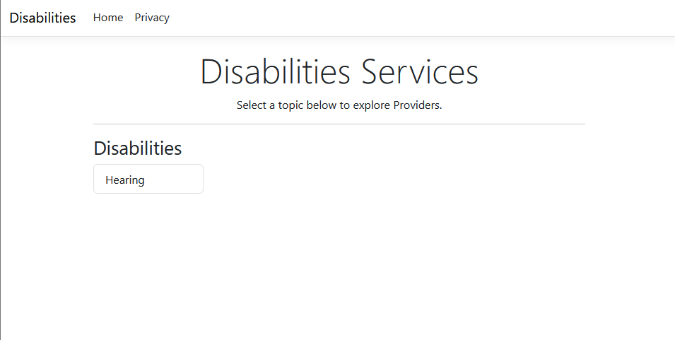
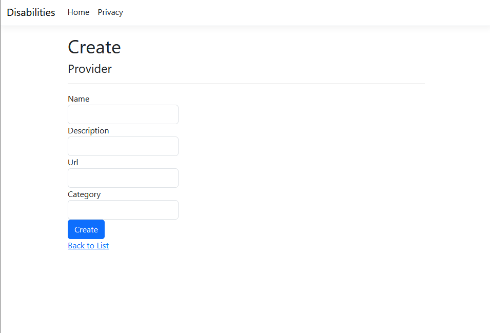
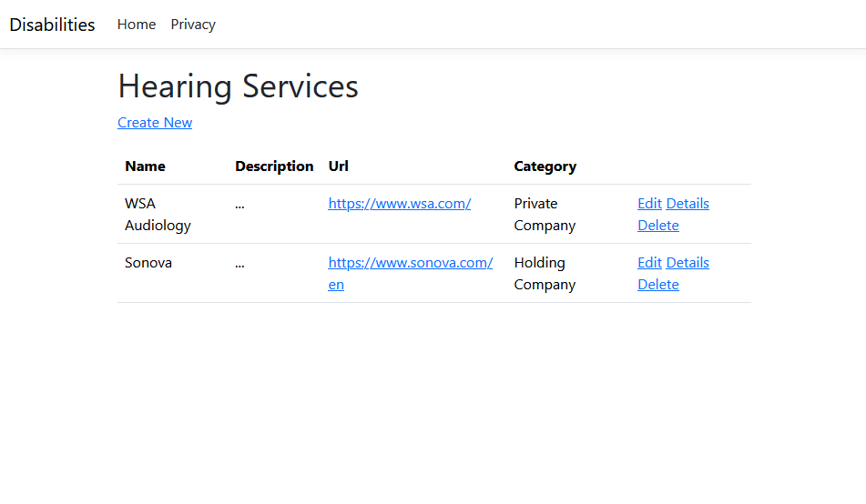

# Accessibility Hub

## Summary
An accessibility portal designed to connect people with disabilities with essential technologies, services, and communities.

## Topics

- [Description](#description)
- [Features](#features)
- [Screenshots](#screenshots)
- [Prerequisites](#prerequisites)
- [Installation](#installation)
- [Download](#download)
- [Stack](#stack)
- [License](#license)

## Description

Due to the vast flow of information generated by the internet, people with disabilities (PwD) often face the challenge of information fragmentation. Finding relevant services, assistive technologies, support communities, and accessible content can be a frustrating and time-consuming task, hindering access to opportunities and the strengthening of the community.

The Accessibility Hub was born with the goal of solving this problem by serving as a centralized hub of resources for the community of people with disabilities. The platform aims to facilitate navigation and access to information, aggregating technologies, services, articles, and communities dedicated to accessibility in one single place.

The portal is designed to serve three main audiences:

- **People with Disabilities:** The primary audience, who can find resources specific to their needs, filtering by disability type or service category.

- **Companies and Organizations:** A direct channel for them to showcase their technologies, products, and services to the community they aim to serve.

- **Allies and Family:** A starting point for those close to, supporting, and living with the community, seeking information and ways to help.

## Features

The current version (MVP) of the Accessibility Hub provides the core functionality for browsing and managing accessibility resources.

- **Category Management (Disabilities):**

    - **Browse Categories:** Users can view a list of all pre-defined disability categories available on the platform.
    - **Dedicated Category Pages:** Each category has a dedicated details page that serves as a hub for its specific resources.

- **Provider Management (Complete CRUD):**
    - **List Providers by Category:** View a list of all relevant providers (companies, tools, communities) associated with a specific disability.
    - **View Provider Details:** Access a dedicated page with detailed information for each provider.
    - **Add New Providers:** Ability to add new providers to a disability category through a creation form.
    - **Edit Existing Providers:** Full capability to edit the information of an existing provider.
    - **Delete Providers:** Ability to remove providers from the system.

- **Architecture & Best Practices:**

    - **Clean Architecture:** Built with a decoupled 3-layer architecture (`Entities`, `Infrastructure`, `WebApp`) to ensure separation of concerns and maintainability.
    - **Secure by Design:** Utilizes DTOs (Data Transfer Objects) to create a safe data contract for the application, preventing over-posting vulnerabilities on data submission.
    - **Asynchronous Operations:** Leverages `async/await` for all database interactions to ensure a non-blocking, responsive, and scalable application.

## Screenshots

**Current status of the project's MVP. As the focus is on backend functionality, the UI has been kept clean and functional. The frontend will be enhanced in a future phase.**

## Prerequisites

You will need the following tools installed on your machine:
* [.NET 9 SDK](https://dotnet.microsoft.com/en-us/download/dotnet/9.0)
* [PostgreSQL](https://www.postgresql.org/download/)
* [Visual Studio 2022](https://visualstudio.microsoft.com/vs/)

## Installation

1. **Clone the repository:** `https://github.com/D-Luan/accessibility-hub.git`

2. **Navigate to the WebAPI project folder:** `cd src/AccessibilityHub.WebApp`

3. **Initialize User Secrets:** `dotnet user-secrets init`

4. **Set your connection string:** `dotnet user-secrets set "ConnectionStrings:DefaultConnection" "Host=localhost;Database=YourDbName;Username=YourUser;Password=YourPassword;"`

5. **Apply the Database Migrations:** `dotnet ef database update`

6. **Run the Application:** `dotnet run`

## Stack

- **Backend:** C#, .NET 9, ASP.NET Core MVC, RESTful APIs, Entity Framework Core
- **Frontend:** HTML, CSS, JavaScript, Razor Pages
- **Database:** PostgreSQL
- **Architecture:** Clean Architecture (3-Layer), SOLID, OOP
- **Tools:** Git, GitHub, Visual Studio 2022, .NET CLI, Trello

## License

Distributed under the GNU GENERAL PUBLIC LICENSE v3.0. See the [LICENSE](./LICENSE) for more information.
